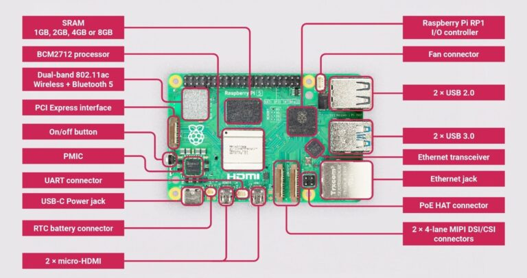
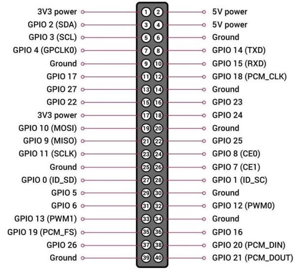

# Raspberry Pi 5
This repo contains C# software for Raspberry Pi 5. My variant has 8 GB RAM.

### Board Components

### GPIO Pinout

## Operating System

The Raspberry Pi 5 can run several OSs. The most popular are Raspian and Ubuntu. \
The software projects in this repo are written for Ubuntu.

## Login

The hostname of the Raspberry Pi 5 is **raspberrypi**. \
User: bcs \
Password: *The usual one*

You can login using ssh.

